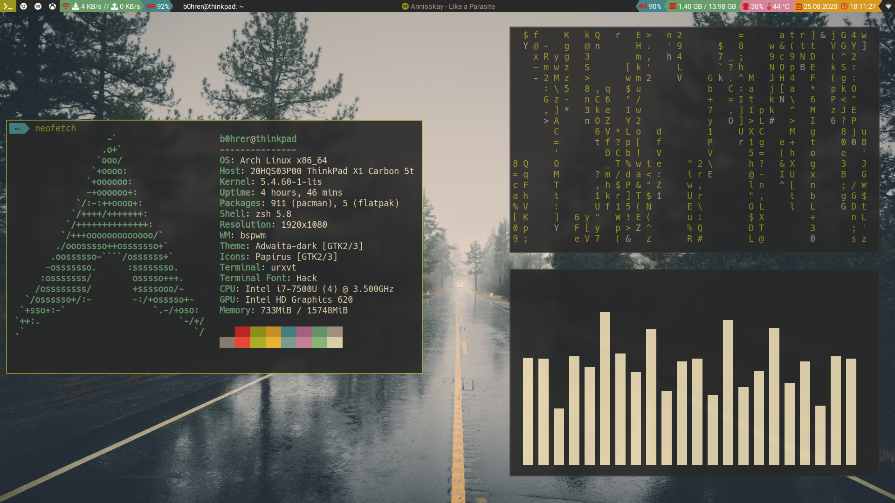

gruvbux themed bspwm setup

installed software
- wm:	 bspwm sxhkd polybar picom-tryone-git rofi i3lock betterlockscreen
- tools: playerctl pulseaudio-alsa pavucontrol light (backlightcontrol) feh (setting wallpapers) rxvt-unicode (+addons) xorg-server xf85-input-synaptics spicetify-cli
- additional stuff: networkmanager nm-applet
- fonts: ttf-hack ttf-symbola ttf-meslo

